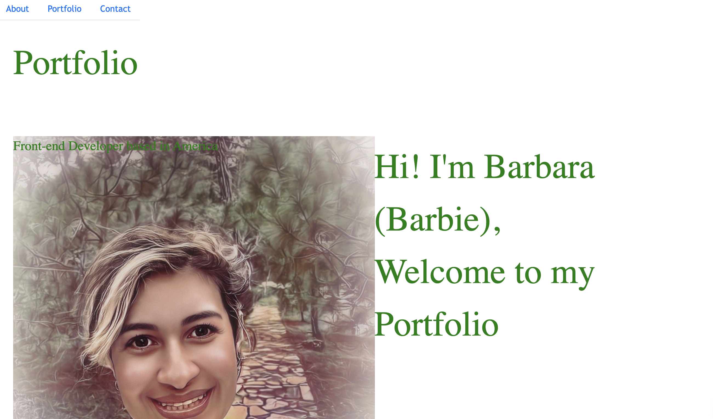

# Portfolio

// =================================
// This file contains the portfolio section.
// It is responsible for rendering the HTML and CSS for this section, as well as handling user interactions with it.
// It is responsible for displaying a list of projects and their details, as well as providing links to view each project in more detail.
//========================================

- Description -

This is a portfolio website for showcasing my projects and skills. It was built using HTML, CSS, JavaScript, ReactJS, Node.js, Express.js, MongoDB, and various projects.

## Installation for Deployment

To run this application, you will need to install Node.js and npm on your computer. Once installed, use the following commands in your terminal:
To run this application, you will need to install Node.js and npm (Node Package Manager).

## USAGE

- NODEJS
- HTML /CSS
- JAVASCRIPT
- EXPRESS
- REACT

## Screen Shots

## FEATURES

Interactive Resume Builder: The user can input information about themselves such as their name, education, work experience, skills, etc., which is then displayed on a customizable resume webpage in
The following features are included in this project:

1. Responsive design that works on all devices with screen sizes of 320px or larger.
2. A user can view deployed projects by clicking on them from a grid layout. The images showcase the deployed applications. When clicked, users can see more information about each project through modals.

## Create React APP

This app was created using "Create React App". It provides a simple way to create single page applications using React without configuring a build system. The documentation is available at [https://create-react-app [Setup]]

### Live URL

## Questions ?

If you have any questions about the repository,
please feel free to contact me at

[Bcort49](mailto:bcort49@gmail.com) or check out my work on [GitHub](https://github.com/bcot-code).
